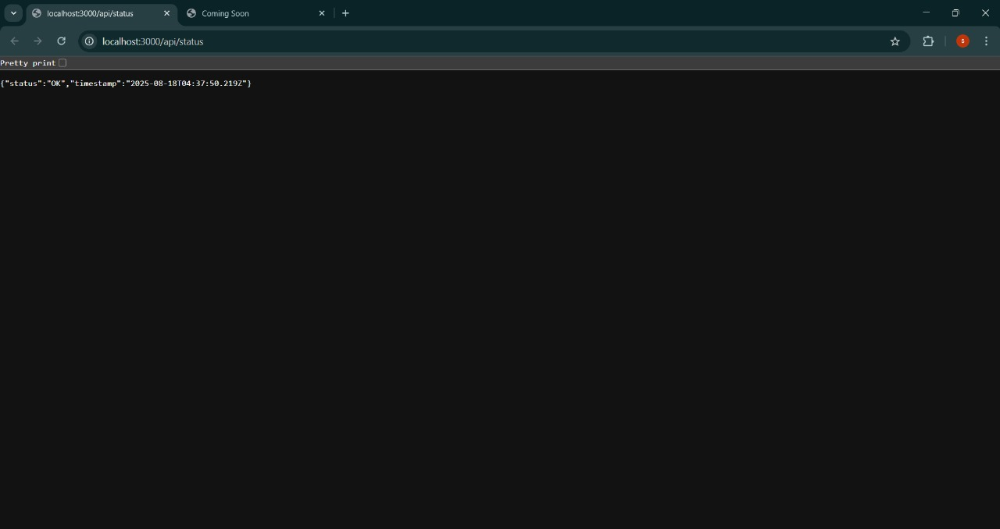

# 🚀 Git Branching Workflow – Node.js Project

A detailed demonstration of **Git branching workflows** using a simple Node.js project.  
This repository showcases version control best practices for DevOps, including branching strategies, pull requests, conflict resolution, and environment setup.

---

## 📌 Overview
This project manages a Node.js application using **Git best practices**, covering:
- Proper branching (`main`, `dev`, `feature-*`)
- Pull requests & merge strategies
- Handling merge conflicts
- Using `.gitignore` for clean repo management
- Maintaining clear documentation

---

## 🛠️ Tools & Technologies
- **Git** – Version control  
- **GitHub** – Remote repo & collaboration  
- **Node.js** – Demo application  
- **Nodemon** – Development server auto-restart  

---

## 📂 Project Structure
```
git-branching-workflow/
├── src/
│   └── index.js         # Node.js app (UI + Coming Soon page)
├── scripts/
│   ├── backup.sh        # Example backup script
│   └── deploy.sh        # Example deployment script
├── screenshots/         # Screenshots of workflow and app
│   ├── branches.jpg
│   ├── api-status.jpg
│   ├── vscode.jpg
│   └── coming-soon.jpg
├── .gitignore           # Ignoring node_modules, logs, etc.
├── package.json         # Node.js dependencies
├── package-lock.json    # Dependency lock file
└── README.md            # Documentation
```

---

## ⚡ Features
- **Branching Workflow**: `main`, `dev`, `feature-node-app`, `feature-scripts`, `feature-readme`, etc.  
- **Node.js App**: Serves a **"Coming Soon" UI page**.  
- **Scripts**: Deployment & backup automation examples.  
- **Git Best Practices**: Commits, merges, conflict resolution, `.gitignore` usage.  

---

## 📸 Screenshots
Here are the screenshots for clarity:

### 1. Branches


### 2. App API-Status


### 3. VS Code and branch TREE


### 4. Running App (UI)


---

## 🚀 How to Run
```bash
# Clone repo
git clone https://github.com/sriramvarma0/git-branching-workflow-task4.git
cd git-branching-workflow-task4

# Install dependencies
npm install

# Start dev server
npm run dev
```

Now open **http://localhost:3000** in your browser 🎉

---

## 🧑‍💻 Git Workflow Steps
1. Initialize repo & create branches (`main`, `dev`, `feature-*`).  
2. Work on **feature branches**.  
3. Push changes and create a **Pull Request**.  
4. Review & merge into `dev`.  
5. After testing, merge `dev` → `main`.  
6. Resolve conflicts when they occur.  
7. Tag versions if needed (`git tag v1.0.0`).  

---

## 🎯 Outcome
- Successfully demonstrated Git branching workflow in a Node.js project.  
- Learned to manage **conflicts, PRs, and branch merges** efficiently.  
- Built a clean and professional **Coming Soon UI page** with automated scripts.  
- Final project runs smoothly with professional Git practices.

---

## 👤 Author
**Sriram Varma Bhupathiraju**  
🔗 [GitHub](https://github.com/sriramvarma0)  
🔗 [LinkedIn](https://www.linkedin.com/in/sriram-varma)


